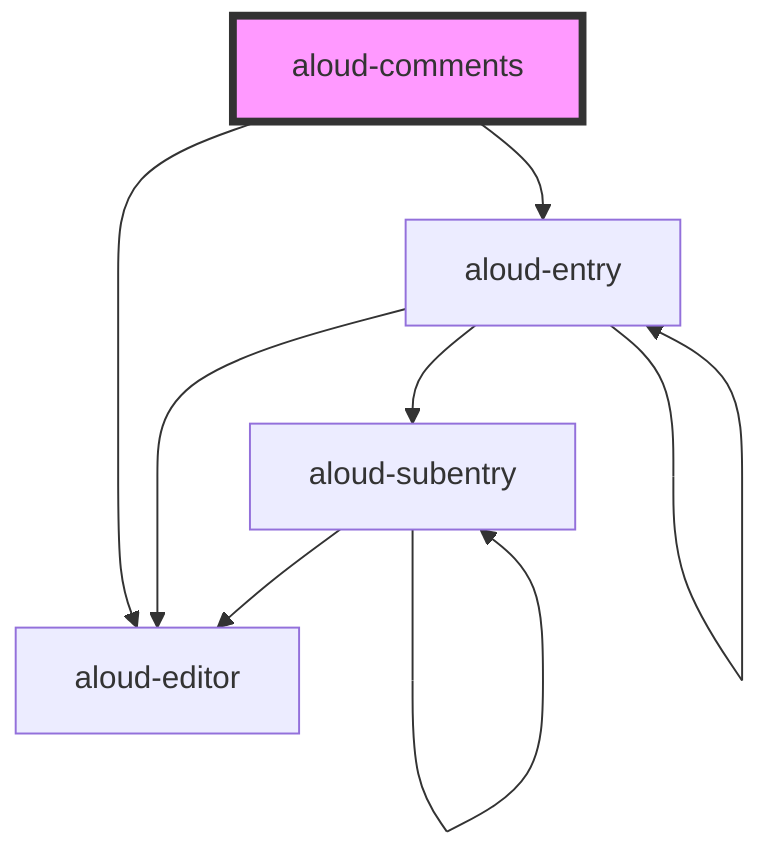

# aloud-comments

<!-- Auto Generated Below -->

## Properties

| Property                | Attribute              | Description                                                                                                     | Type                                 | Default                                                                                       |
| ----------------------- | ---------------------- | --------------------------------------------------------------------------------------------------------------- | ------------------------------------ | --------------------------------------------------------------------------------------------- |
| `_firebase`             | `firebase`             | Firebase configuration. Will be `JSON.parse()`  Requires either string version in HTML or Object version in JSX | `string`                             | `undefined`                                                                                   |
| `api` _(required)_      | --                     | API configuration                                                                                               | `IApi`                               | `undefined`                                                                                   |
| `cmTheme`               | `cm-theme`             | CodeMirror theme                                                                                                | `string`                             | `'default'`                                                                                   |
| `debug`                 | `debug`                | Whether to generate random entries  Requires `faker` to be installed.                                           | `boolean`                            | `false`                                                                                       |
| `firebase` _(required)_ | --                     | Firebase configuration  Actually is nullable in Debug mode.                                                     | `{ [k: string]: unknown; }`          | `undefined`                                                                                   |
| `firebaseui`            | --                     | Custom `firebaseui.auth.AuthUI` object                                                                          | `AuthUI`                             | `undefined`                                                                                   |
| `maxChildrenAllowed`    | `max-children-allowed` | Number of children to load by default                                                                           | `number`                             | `3`                                                                                           |
| `parser`                | --                     | Custom markdown parser                                                                                          | `{ parse: (md: string) => string; }` | `undefined`                                                                                   |
| `theme`                 | `theme`                | Color theme based on awsm.css                                                                                   | `string`                             | `matchMedia('(prefers-color-scheme: dark)').matches     ? 'black'     : 'white'`              |
| `url`                   | `url`                  | URL to be used for the database                                                                                 | `string`                             | `location.href     .replace(/#[^/].*$/, '')     .replace(/#\/$/, '')     .replace(/\/$/, '')` |

## Dependencies

### Depends on

- aloud-editor
- aloud-entry

### Graph

----------------------------------------------

*Built with [StencilJS](https://stenciljs.com/)*
