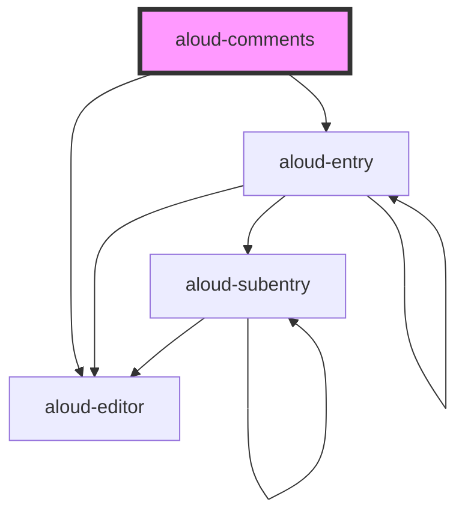

# aloud-comments

<!-- Auto Generated Below -->

## Properties

| Property                | Attribute  | Description                                                                                                     | Type                                 | Default                                                                                         |
| ----------------------- | ---------- | --------------------------------------------------------------------------------------------------------------- | ------------------------------------ | ----------------------------------------------------------------------------------------------- |
| `_firebase`             | `firebase` | Firebase configuration. Will be `JSON.parse()`  Requires either string version in HTML or Object version in JSX | `string`                             | `undefined`                                                                                     |
| `api`                   | --         | API configuration                                                                                               | `IApi`                               | `{     // eslint-disable-next-line @typescript-eslint/no-explicit-any     get: null as any   }` |
| `debug`                 | `debug`    | Whether to generate random entries  Requires `faker` to be installed.                                           | `boolean`                            | `false`                                                                                         |
| `firebase` _(required)_ | --         | Firebase configuration                                                                                          | `{ [k: string]: unknown; }`          | `undefined`                                                                                     |
| `firebaseui`            | --         | Custom `firebaseui.auth.AuthUI` object                                                                          | `AuthUI`                             | `undefined`                                                                                     |
| `parser`                | --         |                                                                                                                 | `{ parse: (md: string) => string; }` | `undefined`                                                                                     |

## Dependencies

### Depends on

- aloud-editor
- aloud-entry

### Graph

----------------------------------------------

*Built with [StencilJS](https://stenciljs.com/)*
