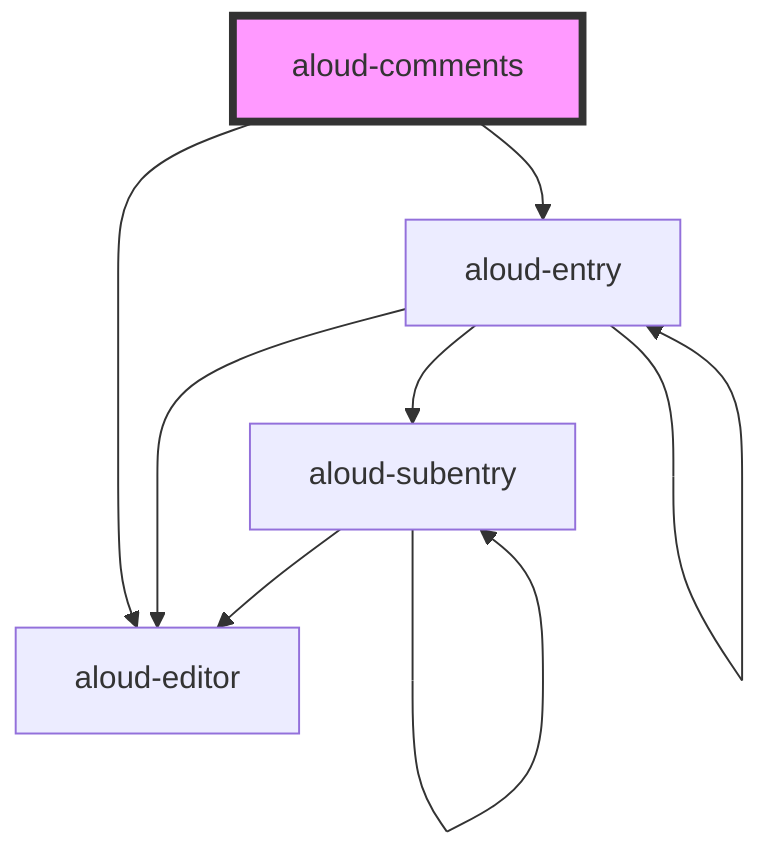

# aloud-comments

<!-- Auto Generated Below -->

## Properties

| Property                  | Attribute  | Description                                                                                                        | Type                                                              | Default          |
| ------------------------- | ---------- | ------------------------------------------------------------------------------------------------------------------ | ----------------------------------------------------------------- | ---------------- |
| `_api`                    | `api`      | API configuration. Will be `yaml.safeLoad()`  Requires either string version in HTML or Object version in JSX      | `string`                                                          | `undefined`      |
| `_firebase`               | `firebase` | Firebase configuration. Will be `yaml.safeLoad()`  Requires either string version in HTML or Object version in JSX | `string`                                                          | `undefined`      |
| `api` _(required)_        | --         | API configuration                                                                                                  | `{ init: string; post: string; update: string; delete: string; }` | `undefined`      |
| `axios`                   | --         | Axios object. Can be ones configured with CSRF or auth.                                                            | `AxiosInstance`                                                   | `axios.create()` |
| `debug`                   | `debug`    |                                                                                                                    | `boolean`                                                         | `false`          |
| `firebase` _(required)_   | --         | Firebase configuration                                                                                             | `{ [k: string]: unknown; }`                                       | `undefined`      |
| `firebaseui` _(required)_ | --         |                                                                                                                    | `AuthUI`                                                          | `undefined`      |

## Dependencies

### Depends on

- aloud-editor
- aloud-entry

### Graph

----------------------------------------------

*Built with [StencilJS](https://stenciljs.com/)*
